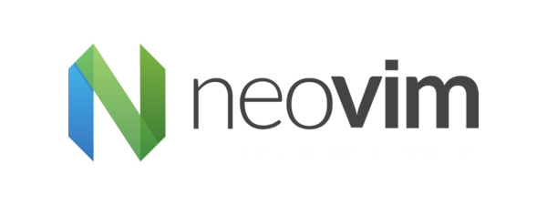

<div align="center">
	<h1>
		<picture>
			
		</picture>
	</h1>
</div>

# Nvimrc 

Plugins are managed via `lazy.nvim` and will automatically synchronize on nvim launch. LSP providers are managed via
`mason`.

## Setup

### Prerequisites

#### Search

If you want to use live text search (`<leader>F`), you will need to have `ripgrep` installed. The latest stable release
can be obtained from [here](https://github.com/BurntSushi/ripgrep).

#### Clipboard

If you want copy paste support from/into buffers, you will need a clipboard tool installed:

```bash
$ sudo pacman -S wl-clipboard xclip xsel
```

#### Packages

**Fonts**:
```bash
$ sudo pacman -S ttf-cascadia-code \
	ttf-cascadia-mono-nerd
```

### Installation

Clone the repository under `~/.config/nvim`:
```bash
$ git clone git@github.com:BKHZ/nvimrc.git ~/.config/nvim
```

Start neovim:
```bash
$ nvim
```

## License

This project is licensed under the [MIT License](LICENSE).
